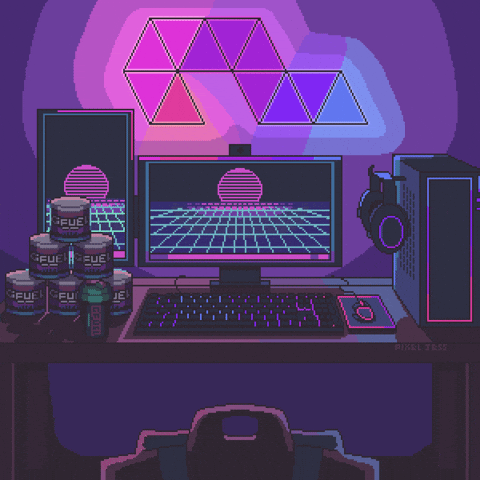

<h1 align="center">Hi 👋, I'm Ruvini Nanayakkara</h1>
<h3 align="center">"I'm A Full-Stack Software Developer💻 | Exploring Solutions, One line Of Code At A Time."</h3>

  

  

  

- 🔭 I’m currently working on **Web Application**

- 🌱 I’m currently learning **Java | React**

- 📫 How to reach me **ruvinikaveesha2005@gmail.com**

- ⚡ Fun fact **I’m always learning, coding, and solving—sometimes all at once!**

<h3 align="left">Connect with me:</h3>

<h3 align="left">Languages and Tools:</h3>

           

&nbsp;

